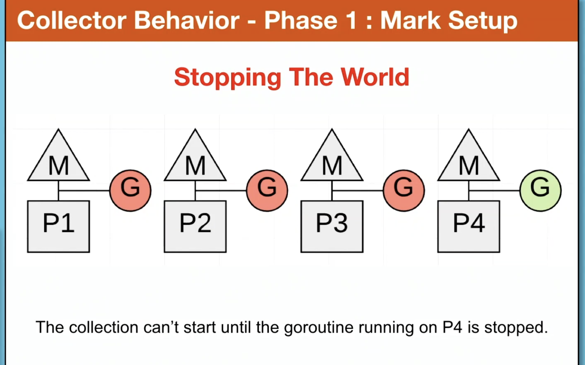
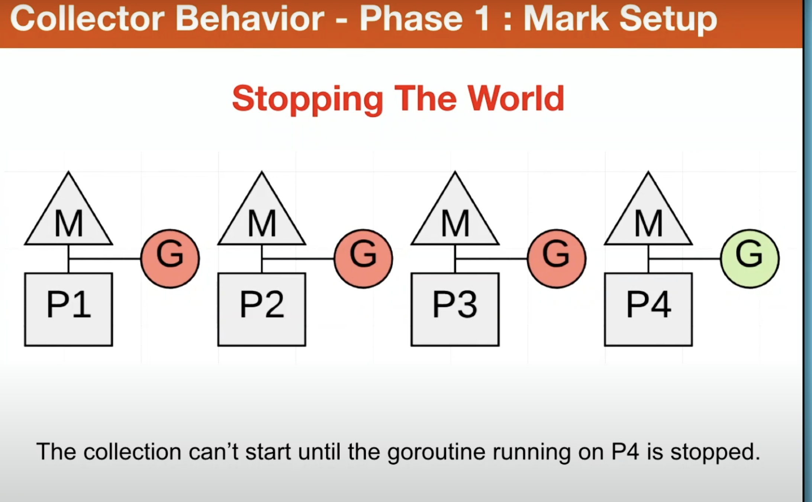
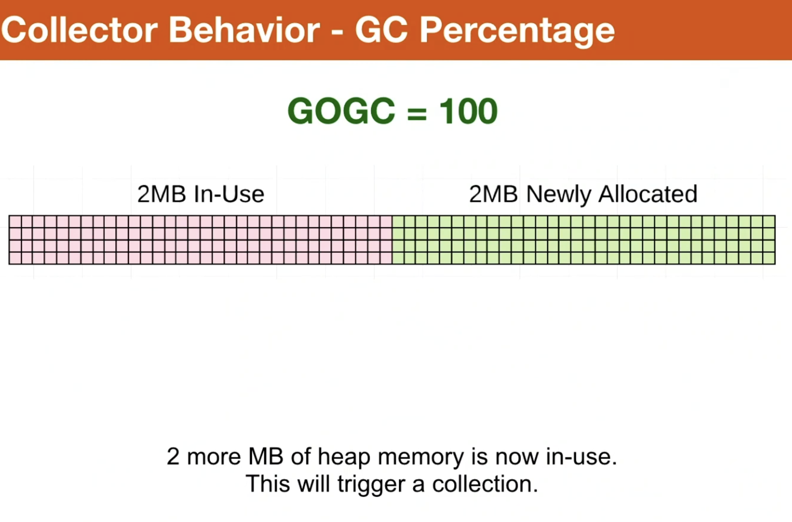
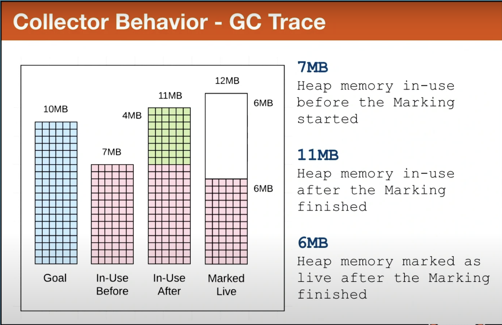

# Garbage Collection

- Garbage collection (GC) is a process used in programming languages to automatically reclaim memory that is no longer being used by the program.

## Phases of Garbage Collection

- Mark Setup - STW (Stop the world)

- Marking - Concurrent

- Mark Termination - Stop the World

## Mark Setup

- When a collection starts , the first activity must be performed is turning on the **Write barrier**

- In order to turn the write barrier on ,every application goroutine must be stopped.

## Marking

- Inspect the stack to find the root pointers to the heap

- Traverse the heap graph from root pointers.

- Mark values on the heap that are still in use.

- The collector takes the 25% of available CPU for itself.

## Mark Assist

- Slow down allocations , in turn speed up collection

- Goal of the collector is to eliminate the need for Mark Assists.

- If collection requires lot of mark assist , the collector can start the next collection earlier.

- Mark assists is basically , a goroutine allocates lot of memory and in use , the collector needs to come and mark which objects and all are in use , so if the memory allocation is huge it needs to do a lot of work, so if the goroutine knows itself that this big chunk of memory will be used, the code will mark it as used and collector can collect it.

## Mark Termination

- Turn the write barrier off.

- Cleanup tasks are performed.

- Next collection goal is calculated

- Goroutines are stopped while mark termination completes.

## Sweeping

- Non marked objects are cleaned and put in further use

- Occurs when goroutine allocates new memory

- The latency of sweeping is added to part of allocation not GC.

## GC Percentage

- Set to 100 by default.

- Represents ratio of how much heap memory can be allocated before the next collection has to start.

- Set with ``GOGC`` env variable

- Ratio of how much heap memory can be allocated before next collection starts.

Great question. Let's clarify what `GOGC=100` **actually means** in Go's garbage collector.

---

### ✅ Meaning of `GOGC=100`:

`GOGC` sets the **garbage collection target percentage** in Go.

* `GOGC=100` means:
  **"Start a new GC cycle when the heap has grown by 100% (i.e., doubled) since the last collection."**

---

### 🔍 Breakdown:

Let's say:

* After the last GC, your program had **heap of 50 MB** live objects.
* With `GOGC=100`, GC will wait until heap grows to **50 MB (original) + 50 MB (100%) = 100 MB** before triggering the next GC.

---

### 🧠 Important Notes:

* **It does *not* mean GC waits until *all allocated memory is full*.**
* It simply controls **how aggressively or lazily** GC runs.

---

### 📊 Examples:

| GOGC Value | Behavior                                 |
| ---------: | ---------------------------------------- |
| `GOGC=100` | (Default) Balanced memory vs CPU usage   |
| `GOGC=200` | GC runs less often → more memory used    |
|  `GOGC=20` | GC runs very frequently → more CPU used  |
| `GOGC=off` | Disables GC completely (not recommended) |

---

### 🚀 Summary of GC Percentage:

> ❗️`GOGC=100` means GC will run when heap memory grows by **100%** since the last GC cycle — not when “100% of allocation is done.”

## Pacing

- Algorithm which is used to determine when the collection should start

- Feedback loop to gather information about the running application and status.

- Stress that determines the pace at which collector needs to run.

## Collection Cadance

- Calculates an estimate of time it takes to finish the collection

- Every collection adds overall latency to the application.

- Misconception is thinking that slowing down the pace of the collector is a way to improve performance.

## Reduce Allocations

- Get more work done between each collection or during the collection

- Reduce the amount of number of allocations any piece of work is adding to heap memory.

## Latency Costs for GC

- Stealing CPU capacity

- Stop the World latency.

## Reduce Stress on Heap memory

- Stress can be defined as how fast the application is allocating heap memory within a given amount of time.

- When stress is reduced the latency inflicted by the collectors will be reduced.

- It's the GC latencies that are slowing down the applications.

