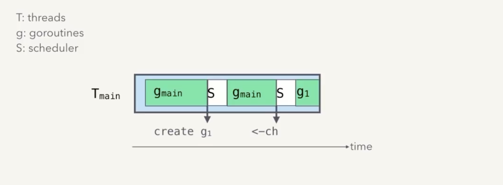

# Scheduler In depth

- Goroutines are user space threads managed by the OS , But managed entirely by the goruntime

- Goroutines are lighter and cheaper than kernel threads, Smaller memory footprint , initial goroutine stack = 2kb, default thread stack = 8kb,State tracking overhead.

- Faster destruction, creation and context switches , Goroutine switches is in nanoseconds , where thread is microseconds.

- OS knows only to schedule and run the kernel threads , But how do we run the goroutines , Scheduler puts the goroutine in the OS threads and inturn it runs on the CPU.

- The scheduling happens when ever something affects goroutine (pausing ,creation,network io).

## Scheduling Goals

- Use small number of kernel threads , Kernel threads are expensive to create

- Support high concurrency , One a N core machiness, Go programs should be able to run N goroutines in parallel.

- Whenever some change related to goroutines happens , the runtime causes a switch into the scheduler under the hood and the scheduler may schedule a different goroutine on this thread.

 
 ## Runqueue

- Whenever Goroutines are ready to run and need to be scheduled are tracked in heap allocated FIFO (runqueues).

- Create threads when needed , keep them around for reuse (i.e.) do thread parking and put them to sleep , so that they dont consume CPU can be wokeup whenever needed.

- If local runq is empty steal work from other runqueue